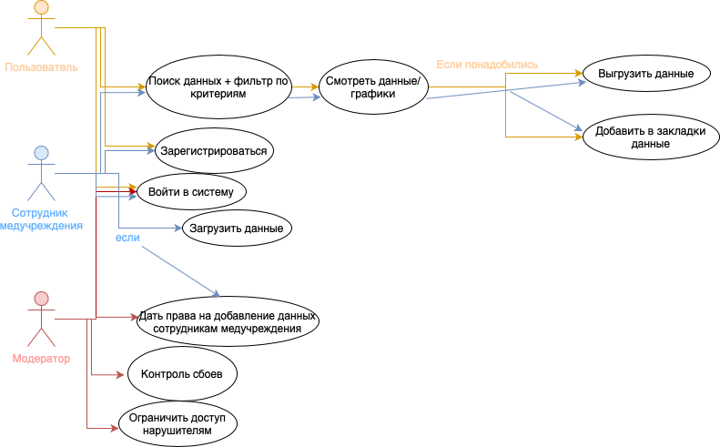

## Классы пользователей проекта:
* Любой пользователь интернета, которому интересно посмотреть какую-то статистику
* Пользователи, которым нужны данные для различных исследований
* Работники медучреждений, которые могут добавлять свои данные
* Модераторы, которые будут работу продукта и добавлять новые данные + следить, чтобы остальные пользователи не нарушали данные
* Сотрудник медучереждения: обычный пользователь + может загружать данные (на это есть права у него, как-то модератор это подтвердит, пройдя проверку)

## Use case диаграмма

## User Story 
* Как работник медучереждения, я хочу уметь возможность удобно выгружать данные, чтобы потом другие пользователи могли их использовать для своих исследований
* Как исследователь, я хочу иметь возможность получать данные по различным критериям, чтобы использовать для своих исследований
* Как исследователь, я хочу иметь возможность зайти на сайт и зарегистрироваться, чтобы иметь возможность сохранять какую-нибудь информацию (например, датасеты добавлять в закладки или еще что-то) у себя в личном кабинете
* Как модератор я хочу иметь возможность проверить кто и откуда загружает данные, чтобы проверять их достоверность

## Job Story
* Когда я провожу исследование, хочется уметь искать данные по определенным критериям, чтобы это соответствовало тематике моего исследования
* Когда много данных, хочется понимать откуда они приходят и рейтинг этих мест, чтобы понимать насколько они достоверны
* Когда пациент чем-то болеет, то хочется посмотреть на людей с похожими данными и статистику, чтобы заранее выявить какие-то заболевания
* Когда нужна какая-то информация, хочется получать самую новую, чтобы мои результаты исследований основывались на актуальной информации

